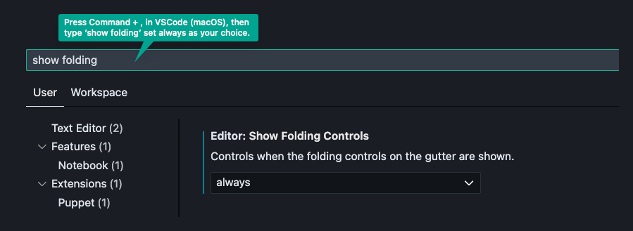

# ⚙️ GitHub Actions 

You can find some Github actions in the .github/workflows folder as well as notes below. 

##  Helpful Tips 

- [One of several helpful GH Actions tutorials](https://www.youtube.com/watch?v=5xngh29yx9A)
- [VSCode folding](https://www.youtube.com/watch?v=63Ck0LTzaps)
  - Because GH actions can turn into very large files it would be helpful to make sure folding is enabled in your IDE. 
  
- [Keyboard shortcuts related to Folding in VSCode](https://stackoverflow.com/questions/30067767/how-do-i-fold-collapse-hide-sections-of-code-in-visual-studio-code)
- [🔌 GitHub Actions VSCode Extension](https://marketplace.visualstudio.com/items?itemName=GitHub.vscode-github-actions)
  - Bring up a terminal in your VSCode editor to see the `Problems` tab to view detected issues in your Workflows.
  - The built-in Actions runner/viewer is not very good. 
- [Actions Cheatsheet](https://github.github.io/actions-cheat-sheet/actions-cheat-sheet.pdf)
- [ 🛍️ GitHub Actions Marketplace](https://github.com/marketplace?type=actions)

## 📙 Notes 

- [Chapter 1 - Core Concepts](./Notes/Chapter-1.md)
  - Event Workflow Triggers   
  - Jobs 
  - Artifacts Upload/Download
  - Using Concurrency 
  - 🕰️ Timeouts 
  - Environment Variable Storage 
  - Repository Level Secrets/Variables 
  - Example GitHub Actions
- [Chapter 1.1 - Core Concepts](./Notes/Chapter-1.1.md)
  - [Matrix Strategies (Example #11)](https://docs.github.com/en/actions/writing-workflows/choosing-what-your-workflow-does/running-variations-of-jobs-in-a-workflow)
  - [Contexts](https://docs.github.com/en/actions/writing-workflows/choosing-what-your-workflow-does/accessing-contextual-information-about-workflow-runs) 
  - [Expressions](https://docs.github.com/en/actions/writing-workflows/choosing-what-your-workflow-does/evaluate-expressions-in-workflows-and-actions) (Example #13)
  - [Workflow Event Filters and Activity Types](https://docs.github.com/en/actions/writing-workflows/choosing-when-your-workflow-runs/events-that-trigger-workflows)
  - [Skipping workflow runs](https://docs.github.com/en/actions/managing-workflow-runs-and-deployments/managing-workflow-runs/skipping-workflow-runs)
  - [Debug Logging](https://docs.github.com/en/actions/monitoring-and-troubleshooting-workflows/troubleshooting-workflows/enabling-debug-logging)
  - [Workflow Logs via RestAPI](https://docs.github.com/en/rest/actions/workflows?apiVersion=2022-11-28) (No example workflow)
  - [Workflow Dispatch Inputs](https://docs.github.com/en/actions/writing-workflows/workflow-syntax-for-github-actions#onworkflow_dispatch) (Example #15) 
  - Triggers Events with Webhooks 
- [Chapter 2 - Additional Deployment Concepts](./Notes/Chapter-2.md)
  - Expressions
  - Status Check Functions 
  - [Cache Dependencies for a Job](https://docs.github.com/en/actions/writing-workflows/choosing-what-your-workflow-does/caching-dependencies-to-speed-up-workflows)
  - GitHub Packages 
  - [Publish Node.js packages](https://docs.github.com/en/actions/use-cases-and-examples/publishing-packages/publishing-nodejs-packages)
  - [Job Container](https://docs.github.com/en/actions/writing-workflows/choosing-where-your-workflow-runs/running-jobs-in-a-container)
  - [Service Containers](https://docs.github.com/en/actions/use-cases-and-examples/using-containerized-services/about-service-containers)
- [Chapter 3 - Kubernetes Based Deploy Concepts](./Notes/Chapter-3.md)
- Adding a `KUBECONFIG` file to your action
  - Using the `KUBECONFIG` file and setting context 
  - Kubernetes Placeholders 
  - [Setting an Environment Variable](docs.github.com/en/actions/using-workflows/workflow-commands-for-github-actions#setting-an-environment-variable)
  - [Passing values between steps and jobs in a workflow](docs.github.com/en/actions/learn-github-actions/variables#passing-values-between-steps-and-jobs-in-a-workflow)
  - Understanding GitHub Environments 
- [Chapter 4 - Reusable Actions](./Notes/Chapter-4.md)
  - [Reusing workflows](https://docs.github.com/en/actions/sharing-automations/reusing-workflows)
  - [Sharing actions in a private repo](https://docs.github.com/en/actions/sharing-automations/sharing-actions-and-workflows-from-your-private-repository)
  - Secrets in Reusable Workflows 
  - [Using Outputs from a Reusable Workflow](https://docs.github.com/en/actions/sharing-automations/reusing-workflows#using-outputs-from-a-reusable-workflow)
  - [Starter Workflows](https://docs.github.com/en/actions/sharing-automations/creating-workflow-templates-for-your-organization)
- [Chapter 5 - Custom Actions](./Notes/Chapter-5.md)


## Retrieve Chapter Concepts from Markdown Files 

```bash
ggrep "^##" Chapter-1.md | sed 's/^##/-/'
```